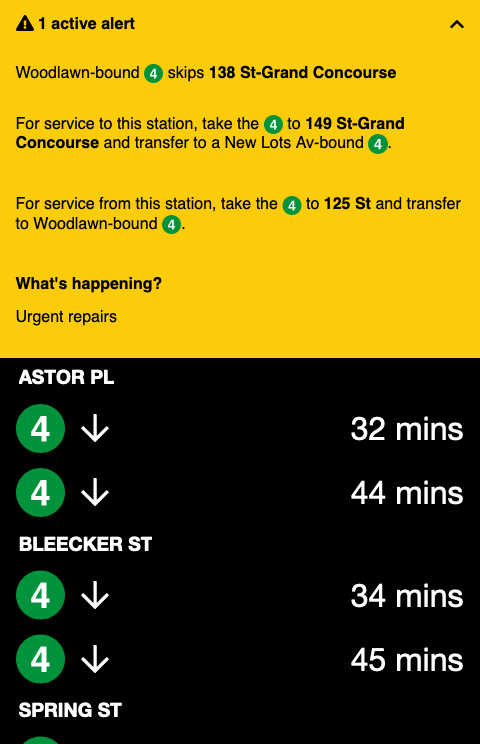

# [closingdoors.nyc](https://closingdoors.nyc/)

A minimalist subway schedule viewer written in React.

An implementation of the backend GraphQL interface can be found [here](https://github.com/cedarbaum/transiter-graphql-proxy).

<p align="center">
  
  
  
</p>

## Setup and build

### Initial setup

Currently, this project requires Font Awesome Pro for some of its icons (see: https://github.com/cedarbaum/closingdoors.nyc/issues/1). To configure NPM to pull in the required packages, [configure access](https://fontawesome.com/docs/web/setup/packages#_1-configure-access).

### Enabling a proxy

For this local app to communicate with the AppSync endpoint:

1. Set the "proxy" property in `package.json` to the base AppSync URL:

```json
  "proxy": "https://XXXXXXXXXXXXXXXXXXXXXXXXXX.appsync-api.us-east-1.amazonaws.com/",
```

2. In `App.tsx`, uncomment the `httpLink` and `authLink` constructs and pass the composite link to the `ApolloClient`:

```typescript

const httpLink = createHttpLink({
  uri: "/graphql",
});

const authLink = setContext((_, { headers }) => {
  return {
    headers: {
      ...headers,
      "x-api-key": "XXXXXXXXXXXXXXXXXXXXXXXXXXXXXX",
    },
  };
});

const client = new ApolloClient({
  // uri: '/graphql',
  link: authLink.concat(httpLink),
  cache: new InMemoryCache(),
});

```

### Building

1. `npm install`
2. `npm run build`
3. `npm start`: starts page at [http://localhost:3000](http://localhost:3000)

To use storybook:

1. `npm run storybook`

### Deploying to AWS

See the infrastructure [README](./infrastructure/README.md).

## Similar projects

- [realtimerail.nyc](https://github.com/jamespfennell/realtimerail.nyc-react)
- [WTFT](https://github.com/jonthornton/WTFT)

## Licensing

- Usage of the MTA's subway icons and other intellectual property has been granted through their [licensing program](https://new.mta.info/doing-business-with-us/licensing-program).
