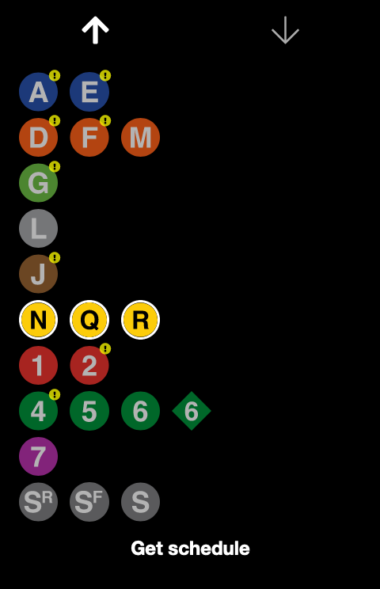

# closingdoors.nyc

A minimalist subway schedule viewer written in React. See it live here: [https://closingdoors.nyc/](https://closingdoors.nyc/.

  
   

## Building and running locally

1. `npm run build`
2. `npm start`: starts page at [http://localhost:3000](http://localhost:3000) which communicates with the GraphQL endpoint [https://closingdoors.nyc/graphql](https://closingdoors.nyc/graphql)

To use storybook:

1. `npm run storybook`

### Deploying to AWS

See the infrastructure [README](./infrastructure/README.md).
