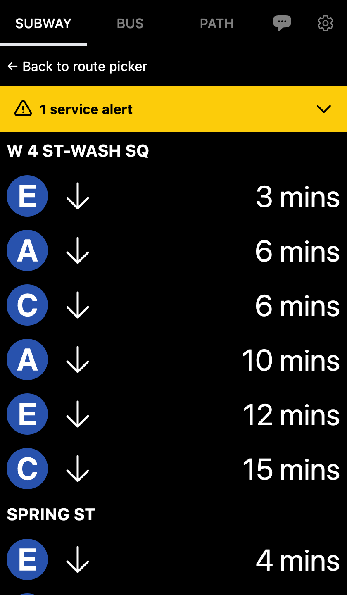
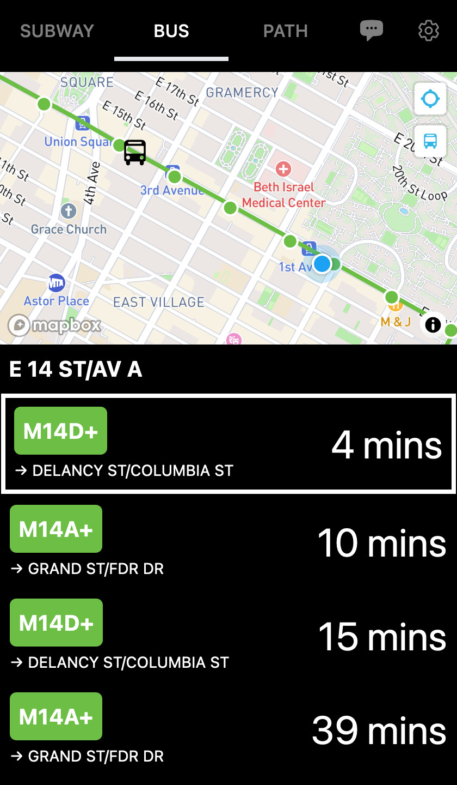
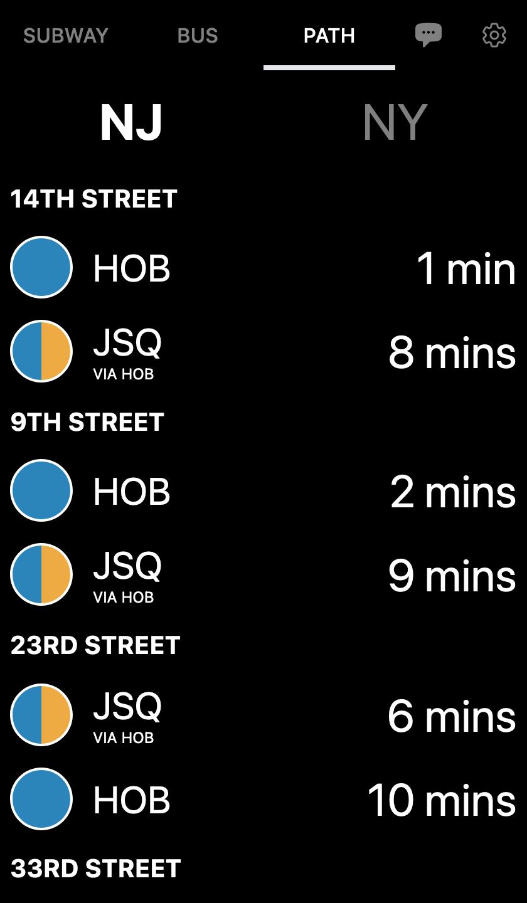

# [closingdoors.nyc](https://closingdoors.nyc/)

A minimalist NYC subway, bus, and PATH schedule viewer written in React.

<p align="center">
  
  
  
</p>

## Setup

### Schedule data

This project relies on [Transiter](https://github.com/jamespfennell/transiter) for fetching data. After running Transiter locally or hosting it, set the `TRANSITER_URL` environment variable (it is recommended to use a `.env.local` file) to the base URL of the HTTP endpoint:

```
TRANSITER_URL="http://localhost:8080"
```

By default, it is assumed that the NYC Subway (`us-ny-subway`) is installed in your Transiter instance. The UI also supports the NYC Bus system (`us-ny-nycbus`) and the NYC/NJ PATH train (`us-ny-path`). If you wish to enable other systems, you can set the below environment variable with a comma separated list of system IDs. Note that if you wish to remove the NYC subway, you should also change the root path redirect set in [next.config.js](./next.config.js) to point to the path of an installed system.

```
NEXT_PUBLIC_ENABLED_SYSTEMS="us-ny-subway,us-ny-nycbus,us-ny-path"
```

Transiter uses gRPC protobuf definitions for it's API. TypeScript types can be generated from this, which are then used to annotate the data returned from Transiter. To generate new types:

1. Install the [Buf CLI](https://buf.build/product/cli/)
2. Copy the newest `public.proto` file from Transiter to `proto/transiter/`
3. From the `proto/` directory, run `buf generate`

The above only needs to be done if the API definition changes, since generated files are checked in.

### Configuring max stop distance for each system

The maximum range (in KM) to fetch stops for each system can be configured with the below environment variables:

```
# Default max stop distance if not specified for a system
NEXT_PUBLIC_MAX_STOP_DISTANCE_KM=3.2

# Max distance for NYC Subway stops
NEXT_PUBLIC_US_NY_SUBWAY_MAX_STOP_DISTANCE_KM=3.2

# Max distance for NYC Bus stops
NEXT_PUBLIC_US_NY_NYCBUS_MAX_STOP_DISTANCE_KM=1.6

# Max distance for PATH stops
NEXT_PUBLIC_US_NY_PATH_MAX_STOP_DISTANCE_KM=10.0
```

Additionally, since the NYC bus system is very dense, the max number of stops returned can also be limited using:

```
NEXT_PUBLIC_US_NY_BUSES_MAX_STOPS=30
```

### Chat feature (experimental)

To enable the chat feature, set the below environment variable:

```
NEXT_PUBLIC_CHAT_ENABLED="true"
```

In addition to Transiter, the chat feature requires an OpenAI API key and a Google Maps API key:

```
# Google maps API credentials
OPENAI_API_KEY="xxxxxxxxxxxxxxxxxxxxxxxxxxxxxxxxxxxxxxxxxxxxxxxxxx"
GOOGLE_MAPS_API_KEY="xxxxxxxxxxxxxxxxxxxxxxxxxxxxxxxxxxxxxxxxxxxxx"
```

#### Rate limiting

Since the APIs used by the chat feature can be expensive, rate limiting can optionally be enabled:

```
ENABLE_RATE_LIMITING="true"
```

If it is enabled, a Redis URL and access token from [Upstash](https://upstash.com/) are also required:

```
# Redis credentials
UPSTASH_REDIS_REST_URL="https://xxxxxxxxxxxxxxxxxxxxxxxxxxxxxxxxxx"
UPSTASH_REDIS_REST_TOKEN="xxxxxxxxxxxxxxxxxxxxxxxxxxxxxxxxxxxxxxxx"
```

Finally, global daily and per-ip/per-minute rate limits can be configured:

```
# Daily and per IP address limits
DAILY_API_LIMIT=1000
PER_IP_PER_MIN_LIMIT=5
```

## Building and running

1. `npm install`
2. `npm run dev`

## Similar projects

- [realtimerail.nyc](https://github.com/jamespfennell/realtimerail.nyc-react)
- [WTFT](https://github.com/jonthornton/WTFT)

## Licensing and attributions

- Usage of the MTA's subway icons and other intellectual property has been granted through their [licensing program](https://new.mta.info/doing-business-with-us/licensing-program).
- Subway icons are directly from or based on this project: https://github.com/louh/mta-subway-bullets
